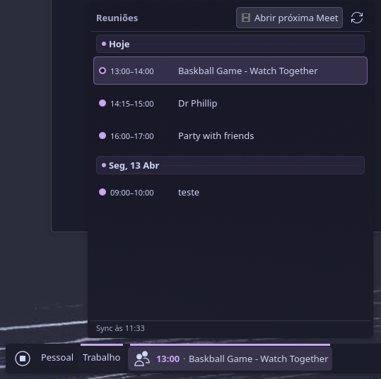

# Plasma Meets

<p align="center">
  
</p>

<p align="center">
  A KDE Plasma 6 widget that shows your upcoming Google Calendar meetings, highlights the next Google Meet in the panel, and opens the call with one click.
</p>

<p align="center">
  <a href="#installation">Installation</a> •
  <a href="#how-to-connect-google-calendar">How to Connect Google Calendar</a> •
  <a href="#features">Features</a>
</p>

## Features

- Shows upcoming meetings in a native Plasma popup.
- Highlights the next meeting directly in the panel with time and title.
- Opens the next Google Meet with one click.
- Syncs automatically with Google Calendar.
- Displays notifications before meetings.
- Lets you customize the panel item mode and the icons being used.

## Installation

Requirements:

- KDE Plasma 6
- `bash`
- `msgfmt` optional, for compiling translations

Install with:

```bash
./install.sh
```

Then:

1. Right-click the desktop or panel.
2. Open `Add Widgets`.
3. Search for `Plasma Meets`.
4. Add the widget.

If you need to restart Plasma:

```bash
kquitapp6 plasmashell && kstart plasmashell
```

## How to Connect Google Calendar

The widget uses OAuth Device Flow. You create a credential in Google Cloud, paste the `Client ID` and `Client Secret` into the widget settings, and authorize the account with the code shown on screen.

### Quick Setup

1. Open `https://console.cloud.google.com/apis/credentials`.
2. Select or create a project.
3. Enable the `Google Calendar API` for that project.
4. Click `Create credentials`.
5. Choose `OAuth client ID`.
6. For application type, choose `TVs and Limited Input devices`.
7. Save.
8. Copy the `Client ID`.
9. Copy the `Client Secret`.
10. In Plasma Meets, open `Configure`.
11. Paste both values.
12. Click `Connect Google Account`.
13. Open the URL shown by the widget.
14. Enter the code displayed by the widget.
15. Authorize the account.

### Short Flow Summary

`Create credentials -> choose the TV device flow -> copy values -> paste into the widget -> authorize with code`

### Where to Paste the Credentials

In the Plasma Meets settings panel:

- `Client ID`: paste the OAuth credential ID.
- `Client Secret`: paste the secret from the same OAuth credential.
- `Connect Google Account`: starts the code-based authorization flow.

If Google returns an error immediately after credential creation, wait a few minutes for propagation and try again.

## Available Settings

- How many days ahead to fetch meetings.
- How many minutes before a meeting to notify.
- Sync interval.
- Panel item mode: icon, time, or time + title.
- Icons for `no meetings` and `has meetings`.

## Project Structure

```text
package/
  metadata.json
  contents/
    ui/
    config/
    knotifications6/
install.sh
```

## License

Copyright (C) Otávio Schwanck dos Santos <otavioschwanck@gmail.com>

This project is free software. You may use, study, modify, and redistribute it under the terms of the `GPL-2.0+` license.
